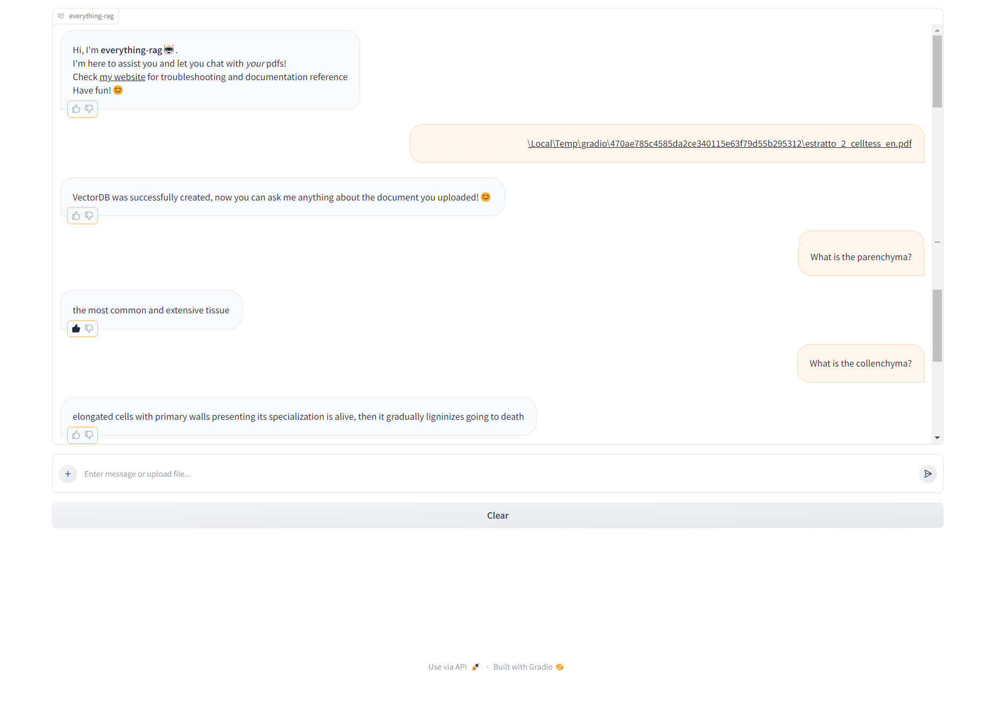

# everything-rag

>_How was this README generated? Levearaging the power of AI with **reAIdme**, an HuggingChat assistant based on meta-llama/Llama-2-70b-chat-hf._
_Go and give it a try [here](https://hf.co/chat/assistant/660d9a4f590a7924eed02a32)!_ 🤖

<div align="center">
    
   
   
   
   
   <div>
        <a href="https://astrabert.github.io/everything-rag/"></a>
        <p><i>Example chat with everything-rag, mediated by google/flan-t5-base</i></p>
   </div>
</div>


### Table of Contents

1. [Introduction](#introduction)
2. [Inspiration](#inspiration)
2. [Getting Started](#getting-started)
3. [Using the Chatbot](#using-the-chatbot)
4. [Troubleshooting](#troubleshooting)
5. [Contributing](#contributing)
6. [References](#reference)

## Introduction

Introducing **everything-rag**, your fully customizable and local chatbot assistant! 🤖

With everything-rag, you can:

1. Use virtually any LLM you want: Switch between different LLMs like _gemma-7b_ or _llama-7b_ to suit your needs.
2. Use your own data: everything-rag can work with any data you provide, whether it's a PDF about data sciences or a document about pallas' cats!🐈
3. Enjoy 100% local and 100% free functionality: No need for hosted APIs or pay-as-you-go services. everything-rag is completely free to use and runs on your desktop. Plus, with the chat_history functionality in ConversationalRetrievalChain, you can easily retrieve and review previous conversations with your chatbot, making it even more convenient to use.

While everything-rag offers many benefits, there are a couple of limitations to keep in mind:

1. Performance-critical tasks: Loading large models (>1~2 GB) and generating text can be resource-intensive, so it's recommended to have at least 16GB RAM and 4 CPU cores for optimal performance.
2. Small LLMs can still allucinate: While large LLMs like _gemma-7b_ and _llama-7b_ tend to produce better results, smaller models like _openai-community/gpt2_ can still produce suboptimal responses in certain situations.

In summary, everything-rag is a simple, customizable, and local chatbot assistant that offers a wide range of features and capabilities. By leveraging the power of RAG, everything-rag offers a unique and flexible chatbot experience that can be tailored to your specific needs and preferences. Whether you're looking for a simple chatbot to answer basic questions or a more advanced conversational AI to engage with your users, everything-rag has got you covered.😊

## Inspiration

This project is a humble and modest carbon-copy of its main and true inspirations, i.e. [Jan.ai](https://jan.ai/), [Cheshire Cat AI](https://cheshirecat.ai/), [privateGPT](https://privategpt.io/) and many other projects that focus on making LLMs (and AI in general) open-source and easily accessible to everyone. 

## Getting Started

You can do two things:

- Play with generation on [Kaggle](https://www.kaggle.com/code/astrabertelli/gemma-for-datasciences)
- Clone this repository, head over to [the python script](./scripts/gemma_for_datasciences.py) and modify everything to your needs!
- Docker installation (🥳**FULLY IMPLEMENTED**): you can install everything-rag through docker image and running it thanks do Docker by following these really simple commands:

```bash
docker pull ghcr.io/astrabert/everything-rag:latest
docker run -p 7860:7860 everything-rag:latest -m microsoft/phi-2 -t text-generation
```
- **IMPORTANT NOTE**: running the script within `docker run` does not log the port on which the app is running until you press `Ctrl+C`, but in that moment it also interrupt the execution! The app will run on port `0.0.0.0:7860`, so just make sure to open your browser on that port and to refresh it after 30s to 1 or 2 mins, when the model and the tokenizer should be loaded and the app should be ready to work!

- As you can see, you just need to specify the LLM model and its task (this is mandatory). Keep in mind that, for what concerns v0.1.0, everything-rag supports only text-generation and text2text-generation. For these two tasks, you can use virtually *any* model from HuggingFace Hub: the sole recommendation is to watch out for your disk space, RAM and CPU power, LLMs can be quite resource-consuming!

## Using the Chatbot

### GUI

The chatbot has a brand-new GradIO-based interface that runs on local server. You can interact by uploading directly your pdf files and/or sending messages, all (for now), by running:

```bash
python3 scripts/chat.py -m provider/modelname -t task
```

### Code breakdown - notebook

Everything is explained in [the dedicated notebook](./scripts/gemma-for-datasciences.ipynb), but here's a brief breakdown of the code:

1. The first section imports the necessary libraries, including Hugging Face Transformers, langchain-community, and tkinter.
2. The next section installs the necessary dependencies, including the gemma-2b model, and defines some useful functions for making the LLM-based data science assistant work.
3. The create_a_persistent_db function creates a persistent database from a PDF file, using the PyPDFLoader to split the PDF into smaller chunks and the Hugging Face embeddings to transform the text into numerical vectors. The resulting database is stored in a LocalFileStore.
4. The just_chatting function implements a chat system using the Hugging Face model and the persistent database. It takes a query, tokenizes it, and passes it to the model to generate a response. The response is then returned as a dictionary of strings.
5. The chat_gui class defines a simple chat GUI that displays the chat history and allows the user to input queries. The send_message function is called when the user presses the "Send" button, and it sends the user's message to the just_chatting function to get a response.
6. The script then creates a root Tk object and instantiates a ChatGUI object, which starts the main loop.

Et voilà, your chatbot is up and running!🦿

## Troubleshooting

### Common Issues Q&A

* Q: The chatbot is not responding😭
    > A: Make sure that the PDF document is in the specified path and that the database has been created successfully. 
* Q: The chatbot is taking soooo long🫠
    > A: This is quite common with resource-limited environments that deal with too large or too small models: large models require **at least** 32 GB RAM and >8 core CPU, whereas small model can easily be allucinating and producing responses that are endless repetitions of the same thing! Check *penalty_score* parameter to avoid this. **try rephrasing the query and be as specific as possible**
* Q: My model is allucinatin and/or repeating the same sentence over and over again😵‍💫
    > A: This is quite common with small or old models: check *penalty_score* and *temperature* parameter to avoid this. 
* Q: The chatbot is giving incorrect/non-meaningful answers🤥
    >A: Check that the PDF document is relevant and up-to-date. Also, **try rephrasing the query and be as specific as possible**
* Q: An error occurred while generating the answer💔
    >A: This frequently occures when your (small) LLM has a limited maximum hidden size (generally 512 or 1024) and the context that the retrieval-augmented chain produces goes beyond that maximum. You could, potentially, modify the configuration of the model, but this would mean dramatically increase its resource consumption, and your small laptop is not prepared to take it, trust me!!! A solution, if you have enough RAM and CPU power, is to switch to larger LLMs: they do not have problems in this sense.

## Contributing


Contributions are welcome! If you would like to improve the chatbot's functionality or add new features, please fork the repository and submit a pull request.

## Reference


* [Hugging Face Transformers](https://github.com/huggingface/transformers)
* [Langchain-community](https://github.com/langchain-community/langchain-community)
* [Tkinter](https://docs.python.org/3/library/tkinter.html)
* [PDF document about data science](https://www.kaggle.com/datasets/astrabertelli/what-is-datascience-docs)
* [GradIO](https://www.gradio.app/)

## License

This project is licensed under the Apache 2.0 License.

If you use this work for your projects, please consider citing the author [Astra Bertelli](http://astrabert.vercel.app).
