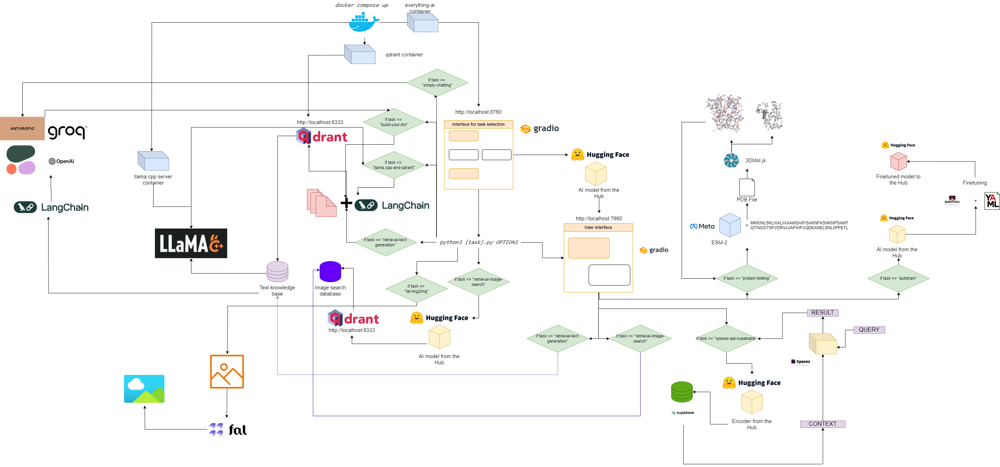

<h1 align="center">everything-ai</h1>
<h2 align="center">Your fully proficient, AI-powered and local chatbot assistant🤖</h2>


<div align="center">
    
   
   
   
   
   
   <div>
        <a href="https://huggingface.co/spaces/as-cle-bert/everything-rag"></a>
        <p><i>Flowchart for everything-ai</i></p>
   </div>
</div>

## Quickstart
### 1. Clone this repository
```bash
git clone https://github.com/AstraBert/everything-ai.git
cd everything-ai
```
### 2. Set your `.env` file
Modify:
- `VOLUME` variable in the .env file so that you can mount your local file system into Docker container.
- `MODELS_PATH` variable in the .env file so that you can tell llama.cpp where you stored the GGUF models you downloaded.
- `MODEL` variable in the .env file so that you can tell llama.cpp what model to use (use the actual name of the gguf file, and do not forget the .gguf extension!)
- `MAX_TOKENS` variable in the .env file so that you can tell llama.cpp how many new tokens it can generate as output.

An example of a `.env` file could be:
```bash
VOLUME="c:/Users/User/:/User/"
MODELS_PATH="c:/Users/User/.cache/llama.cpp/"
MODEL="stories260K.gguf"
MAX_TOKENS="512"
```
This means that now everything that is under "c:/Users/User/" on your local machine is under "/User/" in your Docker container, that llama.cpp knows where to look for models and what model to look for, along with the maximum new tokens for its output.

### 3. Pull the necessary images
```bash
docker pull astrabert/everything-ai:latest
docker pull qdrant/qdrant:latest
docker pull ghcr.io/ggerganov/llama.cpp:server
```
### 4. Run the multi-container app
```bash
docker compose up
```
### 5. Go to `localhost:8670` and choose your assistant

You will see something like this:

<div align="center">
    
</div>

Choose the task among:

- *retrieval-text-generation*: use `qdrant` backend to build a retrieval-friendly knowledge base, which you can query and tune the response of your model on. You have to pass either a pdf/a bunch of pdfs specified as comma-separated paths or a directory where all the pdfs of interest are stored (**DO NOT** provide both); you can also specify the language in which the PDF is written, using [ISO nomenclature](https://en.wikipedia.org/wiki/List_of_ISO_639_language_codes) - **MULTILINGUAL**
- *agnostic-text-generation*: ChatGPT-like text generation (no retrieval architecture), but supports every text-generation model on HF Hub (as long as your hardware supports it!) - **MULTILINGUAL**
- *text-summarization*: summarize text and pdfs, supports every text-summarization model on HF Hub - **ENGLISH ONLY**
- *image-generation*: stable diffusion, supports every text-to-image model on HF Hub - **MULTILINGUAL**
- *image-generation-pollinations*: stable diffusion, use Pollinations AI API; if you choose 'image-generation-pollinations', you do not need to specify anything else apart from the task - **MULTILINGUAL**
- *image-classification*: classify an image, supports every image-classification model on HF Hub - **ENGLISH ONLY**
- *image-to-text*:  describe an image, supports every image-to-text model on HF Hub - **ENGLISH ONLY**
- *audio-classification*: classify audio files or microphone recordings, supports audio-classification models on HF hub
- *speech-recognition*: transcribe audio files or microphone recordings, supports automatic-speech-recognition models on HF hub.
- *video-generation*: generate video upon text prompt, supports text-to-video models on HF hub - **ENGLISH ONLY**
- *protein-folding*: get the 3D structure of a protein from its amino-acid sequence, using ESM-2 backbone model - **GPU ONLY**
- *autotrain*: fine-tune a model on a specific downstream task with autotrain-advanced, just by specifying you HF username, HF writing token and the path to a yaml config file for the training
- *spaces-api-supabase*: use HF Spaces API in combination with Supabase PostgreSQL databases in order to unleash more powerful LLMs and larger RAG-oriented vector databases - **MULTILINGUAL**
- *llama.cpp-and-qdrant*: same as *retrieval-text-generation*, but uses **llama.cpp** as inference engine, so you MUST NOT specify a model - **MULTILINGUAL**
- *build-your-llm*: Build a customizable chat LLM combining a Qdrant database with your PDFs and the power of Anthropic, OpenAI, Cohere or Groq models: you just need an API key! To build the Qdrant database, have to pass either a pdf/a bunch of pdfs specified as comma-separated paths or a directory where all the pdfs of interest are stored (**DO NOT** provide both); you can also specify the language in which the PDF is written, using [ISO nomenclature](https://en.wikipedia.org/wiki/List_of_ISO_639_language_codes) - **MULTILINGUAL**
- *image-retrieval-search*: search an image database uploading a folder as database input. The folder should have the following structure:

```
./
├── test/
|   ├── label1/
|   └── label2/
└── train/
    ├── label1/
    └── label2/
```


You can query the database starting from your own pictures.

### 6. Go to `localhost:7860` and start using your assistant

Once everything is ready, you can head over to `localhost:7860` and start using your assistant:

<div align="center">
    
</div>


